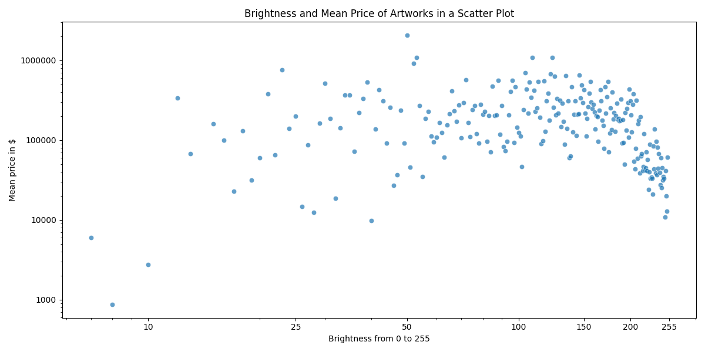
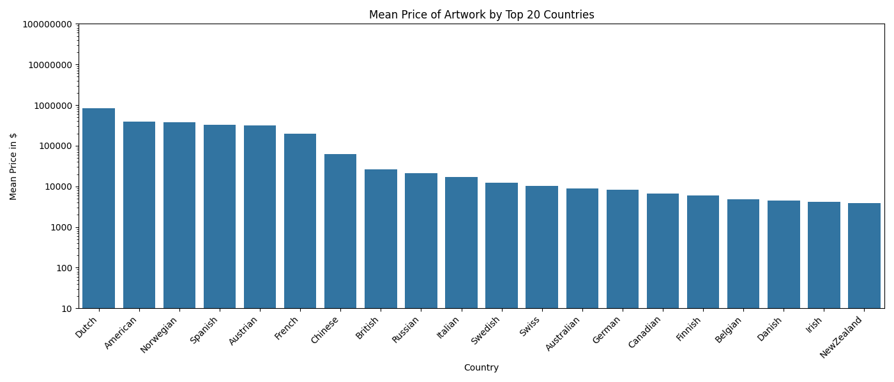
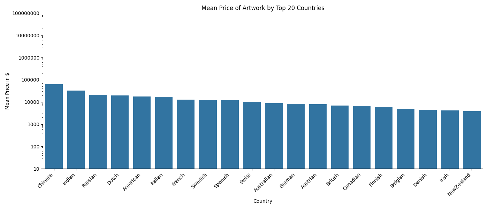
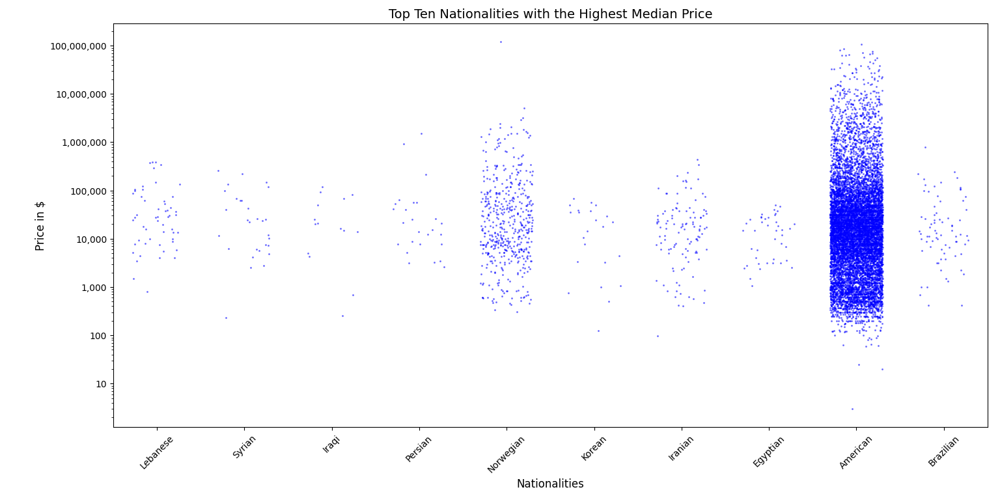

# Economy Of Art 
This project was developed during my Data Science Practicum at TU Berlin in collaboration with my group. We explored how characteristics of artworks and artists influence auction prices. Using a dataset of 37,000+ paintings valued at $9.47B, we analyzed correlations between features such as color brightness and artist nationality with market value. 

## Motivation
Art has existed since the birth of civilizations. It is also a fascinating cross-cultural study due to the diverse ways each culture has expressed itself — whether through painting, sculpture, performance, or other modes and mediums of expression. An interesting fact is that alphabets are, in part, derived from the pictogram-like paintings of Egyptian hieroglyphs, making art ever-present in our language and daily life.

We are interested in exploring the nature of the art world and its intersection with data science. While art appreciation is subjective and can be described poetically or felt emotionally, the price of artworks at auction is an objective measure that we can study to gain valuable insights into the factors that influence value. Therefore, we decided to analyze the economy of paintings to uncover incisive insights into the mechanisms that determine artwork prices.

## Research Question
How do features of the artist (e.g: Nationality) and features of artworks (e.g: Color) influence the price of art in auctions?

## Dataset 
- Dataset from Github : https://github.com/jasonshi10/art_auction_valuation
- Relevant data for our project:
    - Number of art pieces: 37.638 
    - Number of lesser known artist : 7399
    - Number of famous artists: 7
    - Total valuation of artworks: $9.47 billion
    - Artwork color brightness(ranging from 0 to 255)
    - Nationality(Country of origin of the artist)

## Results

- Brightness index (x-axis) taken from dataset origin. Index indicates how bright an image is, where 0 is the darkest possible and 255 is the brightest possible.

- Y-axis indicates mean price which is log scaled(this will be consistent with the graphs below)

- Expectation: Brighter colors tend to be valued more in artworks than their darker counterparts.
- Findings: For the most part, there seems to be a positive correlation between brighter artworks and their value.

- Both above graphs show the same correlation, the only difference being that the latter does not include the famous artists.

- The graphs are sorted from highest mean price to lowest.

- This graph holds the same info as the one before, however this one shows the correlation of median price with the artist's nationality.

- Noticeable change in density when comparing the USA with the others in the top 10.
- Expectations: Western nationality makes a considerable difference in art price/artist monetary success.
- Findings: Western nationality does not bring about a significant correlation to the success of the artist according to our data.

# Conclusion/Discussion
- Regarding the influence of the nationality of the artist to the price of the artwork:

    - Major difference in price of artworks between countries.
    - The countries affected see very noticeable changes in average price.
    - On average without outliers we do not see changes in distribution.

- Median price yields completely different result.
    - Mostly not western countries in the top 10. 
    - In spite of that, the USA has a higher density in terms of units sold than other countries.

- Regarding the influence of brightness of painting to price of artworks:
    - Noticeable avoidance for the lower indexes.
    - Index 80-150 tends to mostly dominate the sales. 
    - After 150, the brighter the artwork the more the price tends to drop.

-  Limitations:
    - The dataset had not conclusive data for certain analysis to be done. While total valuation of artworks in the dataset is $9.47 billion, the global art market size was valued at $552.03 billions, which make the data representative of only 1.82% of the art market.

    - The prices are not adjusted to inflation. (The knowledge gap is already explored in a study by Oxford University, that study is to be found in the reference section)

## Code instructions

- The code and the operationalization is documented on a jupyter notebook file. Alongside it, there is a directory which holds the python code for each plot, in case it is a more preferred method. To run the code, simply clone the repository and run the jupyter notebook from your device. Make sure that all dependencies are accounted for and that the dataset is in the same directory as the code that will run. 

- Alongside the original dataset called data.txt we have also made a cvs copy in case it's a more preferred approach to the data, however our code is set to run from the original dataset.

## Dependencies
- [Python](https://www.python.org/) (3.13)
- [NumPy](https://numpy.org/)
- [pandas](https://pandas.pydata.org/)
- [Matplotlib](https://matplotlib.org/)
- [seaborn](https://seaborn.pydata.org/)
- [Jupyter](https://jupyter.org/)

## References
Oxford Study: Auction and the price of art : https://www.economics.ox.ac.uk/publication/1144302/ora-hyrax

